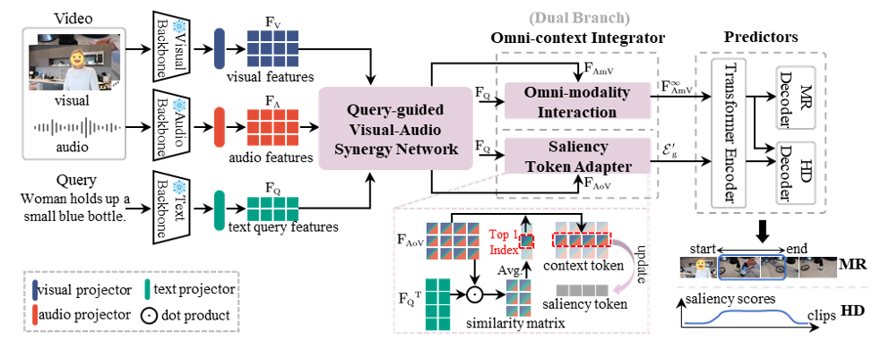

**VABooster**
===

<!-- [](https://arxiv.org/abs/2404.09263) -->
[](https://github.com/EdenGabriel/VABooster/blob/master/LICENSE)


### News


### ✨Introduction
This code repo implements VABooster. Language-guided video moment retrieval and highlight detection have made impressive advancements recently. Most existing methods primarily focus on visual cues in videos. In reality, audio cues in videos also play an indispensable role. In this paper, we highlight the importance of language-guided visual-audio temporal semantic dissonances and propose a novel framework named VABooster. It aims to leverage audio information as boosting cues to jointly address moment retrieval and highlight detection. We propose a visual-audio synergy network to learn task-specific visual-audio features. Additionally, we introduce an omni-modality interaction component with the dual branch structure to capture visual-audio-text contexts for different tasks. A saliency token adapter is designed to regulate the learning process of global saliency tokens. VABooster surpasses the existing state-of-the-art methods with fewer parameters. Extensive experiments and in-depth ablation studies on QVHighlights, Charades-STA, TVSum, and Youtube Highlights datasets substantiate the effectiveness and robustness of the proposed framework.



### 🔎Data Preparation/Installation/More Details
Please refer to [MomentDETR](https://github.com/jayleicn/moment_detr) for more details.

Please refer to [UMT](https://github.com/TencentARC/UMT) for more details.

Please refer to [QD-DETR](https://github.com/wjun0830/QD-DETR) for more details.

<!-- For `temporal shifts in audio', you can visit `shift_1d_feature' function from `start_end_dataset_audio.py', and use it in the `_get_audio_feat_by_vid' function in `start_end_dataset_audio.py'.-->

### 🔧Training and Evaluation
- Train(Take `QVHighlights` as an example)
```python 
bash vabooster/scripts/train.sh 
bash vabooster/scripts/train_audio.sh 
```
- Evaluation (Take `QVHighlights` as an example)
```python
bash vabooster/scripts/inference.sh results/{direc}/model_best.ckpt 'val'
bash vabooster/scripts/inference.sh results/{direc}/model_best.ckpt 'test'
```

### References
If you are using our code, please consider citing the following paper.

```

```

#### The implementation of this code is built upon [MomentDETR](https://github.com/jayleicn/moment_detr) and [QD-DETR](https://github.com/wjun0830/QD-DETR), and we would like to express gratitude for the open-source contribution of [MomentDETR](https://github.com/jayleicn/moment_detr), [QD-DETR](https://github.com/wjun0830/QD-DETR) , [UMT](https://github.com/TencentARC/UMT), and [CG-DETR](https://github.com/wjun0830/CGDETR).
